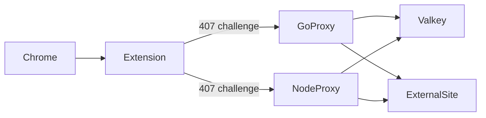

# Forward Proxy with Valkey Domain-Key Auth

Dual HTTP forward proxy implementation (**Node.js** and **Go**) with Valkey-backed domain entitlements, plus a **Chrome extension** that supplies fixed proxy credentials on 407 challenges.

## Overview

Each allowed domain is a Valkey key. **Key existence** grants access; the value is ignored (use a placeholder like `"1"`):

| Key | Value |
|-----|-------|
| `sessions:{user_session_id}:{domain}` | any (ignored) |

Example: `sessions:alice:google.com` → `1` allows user `alice` to reach `google.com` and subdomains (`www.google.com` matches key suffix `google.com`).

The proxy reads the **username** from `Proxy-Authorization: Basic {user}:{password}`. The password is not validated against Valkey — it exists only for Chrome's proxy auth handshake and credential cache.

Every proxied request is gated by:

1. **Client IP allowlist** (`allowedClientIps`)
2. **Public domains** (`publicDomains`) — optional bypass after IP check
3. **Proxy auth** (`requireProxyAuth: true`) — username + domain key existence in Valkey
4. **Open relay** (`requireProxyAuth: false`) — forward any domain after IP check only (use with caution)

Missing `Proxy-Authorization` returns **407** so Chrome can cache credentials. Wrong domain or IP blocked returns **403**.



## Quick Start

```bash
docker compose up --build
./benchmarks/seed-sessions.sh
```

| Service | Ports | Role |
|---------|-------|------|
| Valkey | 6379 | Session store |
| node-proxy | 8080, 3001 | Node forward proxy + admin API |
| go-proxy | 8081, 9001 | Go forward proxy + admin API |

## Create domain keys

Proxies are **read-only**. Create keys directly in Valkey:

```bash
./benchmarks/seed-sessions.sh
```

Or manually:

```bash
valkey-cli SET 'sessions:alice:google.com' '1' EX 3600
valkey-cli SET 'sessions:alice:example.com' '1' EX 3600
```

Single key:

```bash
./benchmarks/seed-one.sh alice google.com 1 config/go-proxy.json
```

Admin API (read-only): `GET /health`, `GET /sessions/{userSessionId}` returns `{ userSessionId, domains: [...] }`.

## Chrome Extension Setup

1. Open `chrome://extensions` → **Load unpacked** → [`chrome-extension/`](chrome-extension/)
2. **Options** → proxy host/port/scheme (Go=8081, Node=8080)
3. **Popup** → enter **User session ID** + **Password** → Save
4. Browse allowed domains (keys must exist in Valkey)

The extension responds to proxy **407** challenges via `webRequest.onAuthRequired`, supplying stored credentials. Chrome caches them for subsequent requests.

## Manual curl Tests

Missing credentials → 407:

```bash
curl -v -x http://127.0.0.1:8081 https://google.com -o /dev/null
# 407 Proxy Authentication Required
```

Allowed (any password when key exists):

```bash
curl -v -x http://127.0.0.1:8081 -U 'alice:anything' https://google.com -o /dev/null
curl -x http://127.0.0.1:8080 -U 'alice:x' http://example.com/ -I
```

Denied (no key for domain):

```bash
curl -v -x http://127.0.0.1:8081 -U 'alice:x' https://facebook.com -o /dev/null
# 403 domain_not_allowed
```

Open relay:

```bash
# requireProxyAuth: false in config
curl -v -x http://127.0.0.1:8081 https://google.com -o /dev/null
```

## Domain matching

For request host `www.google.com`, the proxy checks Valkey keys in order:

1. `sessions:{user}:www.google.com`
2. `sessions:{user}:google.com`
3. `sessions:{user}:com`

First existing key wins.

## Configuration

**Example** (`config/go-proxy.json`):

```json
{
  "valkeyUrl": "redis://valkey:6379",
  "valkeySessionsPrefix": "sessions",
  "requireProxyAuth": true,
  "publicDomains": [],
  "proxyPort": 8081,
  "adminPort": 9001
}
```

| Field | Description |
|-------|-------------|
| `valkeySessionsPrefix` | Key prefix (default `sessions`) |
| `requireProxyAuth` | When `true`, require `Proxy-Authorization` username and matching domain key. When `false`, open relay after IP check. |
| `publicDomains` | Hosts that skip auth after IP check (`authMode: "public"`) |

**Local run:**

```bash
node node-proxy/src/index.js --config config/node-proxy.json
go run ./go-proxy/cmd/proxy -config config/go-proxy.json
```

**RHEL / systemd:** [`go-proxy/deploy/README.md`](go-proxy/deploy/README.md)

## Error codes

| Code | Meaning |
|------|---------|
| `407` | `missing_credentials` — no `Proxy-Authorization` header |
| `403` | `domain_not_allowed` or IP blocked |
| `502` | Upstream unreachable or Valkey error |

## Benchmarks

```bash
chmod +x benchmarks/*.sh
./benchmarks/seed-sessions.sh
./benchmarks/run.sh
```

See [`benchmarks/results.md`](benchmarks/results.md).
