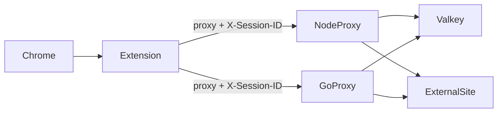

# Forward Proxy with Valkey Domain-Bound Sessions

Dual HTTP forward proxy implementation (**Node.js** and **Go**) with Valkey-backed session-to-domain enforcement, plus a **Chrome extension** that injects `X-Session-ID` and configures the browser proxy.

## Overview

Each session ID maps to exactly one allowed domain in Valkey. Example: `session1234` → `google.com` allows `google.com` and subdomains, but blocks `facebook.com`. Domains listed in `defaultAllowedDomains` in the config file are also permitted for any valid session (same suffix matching rules).

Every proxied request is gated by:

1. **Client IP allowlist** (`ALLOWED_CLIENT_IPS`)
2. **`X-Session-ID` header** (injected by the Chrome extension)
3. **Domain match** between the requested host and the session's Valkey record



## Quick Start

```bash
docker compose up --build
```

| Service | Ports | Role |
|---------|-------|------|
| Valkey | 6379 | Session store |
| node-proxy | 8080, 3001 | Node forward proxy + admin API |
| go-proxy | 8081, 9001 | Go forward proxy + admin API |

Copy and edit config files as needed:

```bash
# Defaults: config/node-proxy.json, config/go-proxy.json
```

## Create a Session

Proxies are **read-only** for sessions. Create and revoke sessions directly in Valkey (not via the proxy admin API):

```bash
./benchmarks/seed-sessions.sh
```

Or manually with `valkey-cli`:

```bash
valkey-cli SET 'session:session1234' \
  '{"domain":"google.com","createdAt":"2026-07-01T12:00:00Z","metadata":{}}' \
  EX 3600
```

The proxy admin API only supports **read** operations: `GET /health` and `GET /sessions/:id`. `POST`/`DELETE` return `405`.

## Chrome Extension Setup

1. Open `chrome://extensions`
2. Enable **Developer mode**
3. **Load unpacked** → select [`chrome-extension/`](chrome-extension/)
4. Open extension **Options** → set scheme (`http` or `https`), host `localhost`, port `8080` (Node) or `8081` (Go)
5. Open extension **Popup** → enter session ID `session1234` → Save
6. Browse to `https://google.com` (allowed) or `https://facebook.com` (blocked with 403)

The extension:

- Sets Chrome's forward proxy via `chrome.proxy.settings`
- Sends the session ID on **plain HTTP proxy requests** as `x-session-id` (declarativeNetRequest)
- Sends the session ID on **HTTPS CONNECT** as `Proxy-Authorization` (username = session ID) via `webRequest.onAuthRequired` when the proxy returns **407** — declarativeNetRequest cannot modify proxy CONNECT headers in Chrome

After saving a session ID in the popup, reload the extension once if CONNECT still logs `missing_session_id`.

**DevTools note:** HTTPS page requests are tunneled after CONNECT. The session is sent on the CONNECT request to the proxy as `Proxy-Authorization`, not on the visible page request. Filter Network by method **CONNECT** to inspect proxy auth headers.

## Manual curl Tests

Allowed (session bound to `example.com`):

```bash
curl -x http://127.0.0.1:8080 \
  -H 'X-Session-ID: session5678' \
  http://example.com/ -I
```

Denied (domain mismatch):

```bash
curl -x http://127.0.0.1:8080 \
  -H 'X-Session-ID: session1234' \
  http://facebook.com/ -I
# HTTP/1.1 403 Forbidden
```

HTTPS CONNECT tunnel (proxy auth username = session ID):

```bash
curl -x http://127.0.0.1:8080 \
  -U 'session1234:session' \
  https://google.com/ -I
```

## Domain Matching Rules

A request is allowed when the host matches the session's Valkey domain **or** any entry in `defaultAllowedDomains` from the config file. Subdomains match (suffix-safe).

| Requested host | Session domain | `defaultAllowedDomains` | Result |
|----------------|----------------|-------------------------|--------|
| `google.com` | `google.com` | `[]` | Allow |
| `www.google.com` | `google.com` | `[]` | Allow |
| `facebook.com` | `google.com` | `[]` | Deny |
| `example.com` | `google.com` | `["example.com"]` | Allow |
| `api.example.com` | `google.com` | `["example.com"]` | Allow |
| `notgoogle.com` | `google.com` | `[]` | Deny |

Matching is suffix-safe: host must equal the domain or end with `.` + domain.

## TLS (when available)

Both proxies read TLS paths from the config file. When `tls.certFile` and `tls.keyFile` point to readable files, proxy and admin listeners use HTTPS; otherwise they use HTTP.

```json
"tls": {
  "certFile": "/certs/tls.crt",
  "keyFile": "/certs/tls.key"
}
```

Place certificates in [`certs/`](certs/) and update the config paths. Use `https` proxy scheme in the Chrome extension when TLS is enabled.

## Admin API (read-only)

| Method | Path | Description |
|--------|------|-------------|
| `GET` | `/health` | Health check (includes `tls: true/false`) |
| `GET` | `/sessions/:id` | Read session from Valkey |
| `POST`/`DELETE`/etc. | `/sessions` | **405** — sessions cannot be modified via proxy |

## Configuration

Both proxies load settings from a **JSON config file** (not environment variables).

| File | Used by | Default ports |
|------|---------|---------------|
| [`config/node-proxy.json`](config/node-proxy.json) | Node proxy | 8080 / 3001 |
| [`config/go-proxy.json`](config/go-proxy.json) | Go proxy | 8081 / 9001 |

Docker Compose mounts each file to `/config/config.json` inside the container.

**Example** (`config/node-proxy.json`):

```json
{
  "valkeyUrl": "redis://valkey:6379",
  "proxyPort": 8080,
  "adminPort": 3001,
  "proxyTimeoutMs": 30000,
  "allowedClientIps": ["127.0.0.1", "::1", "172.16.0.0/12"],
  "trustProxyHeaders": false,
  "sessionHeader": "X-Session-ID",
  "defaultAllowedDomains": ["example.com", "localhost"],
  "tls": {
    "certFile": "/certs/tls.crt",
    "keyFile": "/certs/tls.key"
  }
}
```

| Field | Description |
|-------|-------------|
| `defaultAllowedDomains` | Optional list of domains allowed for every valid session (in addition to the session's Valkey domain). Uses the same suffix matching rules. Default: `[]`. |

**Local run:**

```bash
node node-proxy/src/index.js --config config/node-proxy.json
go run ./go-proxy/cmd/proxy -config config/go-proxy.json
```

Config lookup order when `--config` / `-config` is omitted:

1. `/config/config.json` (Docker default)
2. `./config.json`
3. `./config/node-proxy.json` or `./config/go-proxy.json`

### Valkey Sentinel

When `valkeySentinel` is set with `masterName` and `sentinels`, both proxies connect via **Sentinel failover** instead of a direct `valkeyUrl`. The URL is still used as a fallback label and for tooling (e.g. session seeding).

```json
{
  "valkeyUrl": "redis://valkey-master:6379",
  "valkeySentinel": {
    "masterName": "valkey-master",
    "sentinels": [
      "sentinel-1:26379",
      "sentinel-2:26379",
      "sentinel-3:26379"
    ],
    "password": "",
    "sentinelPassword": "",
    "db": 0
  }
}
```

| Field | Description |
|-------|-------------|
| `masterName` | Sentinel-monitored master name |
| `sentinels` | Sentinel addresses (`host:port`, default port 26379) |
| `password` | Valkey master password (optional) |
| `sentinelPassword` | Sentinel auth password (optional) |
| `db` | Database index (default `0`) |

Full examples: [`config/node-proxy.sentinel.example.json`](config/node-proxy.sentinel.example.json), [`config/go-proxy.sentinel.example.json`](config/go-proxy.sentinel.example.json).

On startup, logs include the active mode, e.g. `{"msg":"valkey configured","mode":"sentinel:valkey-master"}`.

## Benchmarks

```bash
chmod +x benchmarks/*.sh
./benchmarks/seed-sessions.sh
./benchmarks/run.sh
```

Requires [hey](https://github.com/rakyll/hey). Results template: [`benchmarks/results.md`](benchmarks/results.md).

Compare Node (`8080`) vs Go (`8081`) using RPS, p99 latency, and 403 rates on denied domains.

## Error Codes

| Code | Meaning |
|------|---------|
| `400` | Invalid request URL |
| `407` | Missing session ID (extension should respond with proxy credentials) |
| `403` | IP not allowlisted or domain not allowed |
| `404` | Session not found in Valkey |
| `502` | Upstream unreachable |
| `504` | Upstream timeout |

## Project Layout

```
├── config/
│   ├── node-proxy.json                  # Node proxy config (direct Valkey)
│   ├── go-proxy.json                    # Go proxy config (direct Valkey)
│   ├── node-proxy.sentinel.example.json # Sentinel example (Node)
│   └── go-proxy.sentinel.example.json   # Sentinel example (Go)
├── docker-compose.yml
├── chrome-extension/     # Chrome MV3 extension
├── node-proxy/           # Node.js forward proxy
├── go-proxy/             # Go forward proxy
└── benchmarks/           # Load test scripts
```

## Node vs Go Comparison

Run both proxies under the same Valkey instance and use identical session IDs. The benchmark script exercises the same allowed/denied hosts against both implementations. Compare:

- Requests per second
- p50 / p95 / p99 latency
- Memory (`docker stats`)
- 403 rate on domain violations

Both implementations share the same authorization order, domain matching logic, Valkey schema, and error response format for a fair comparison.
