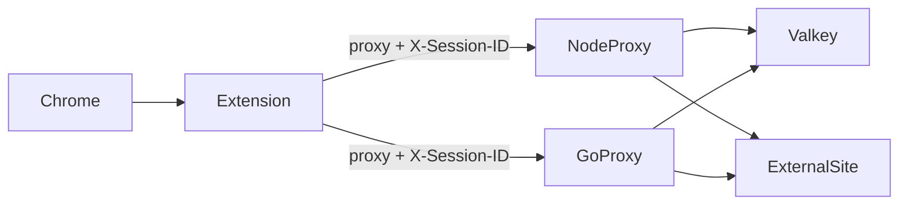

# Forward Proxy with Valkey Domain-Bound Sessions

Dual HTTP forward proxy implementation (**Node.js** and **Go**) with Valkey-backed session-to-domain enforcement, plus a **Chrome extension** that injects `X-Session-ID` and configures the browser proxy.

## Overview

Each session ID maps to exactly one allowed domain in Valkey. Example: `session1234` → `google.com` allows `google.com` and subdomains, but blocks `facebook.com`.

Every proxied request is gated by:

1. **Client IP allowlist** (`ALLOWED_CLIENT_IPS`)
2. **`X-Session-ID` header** (injected by the Chrome extension)
3. **Domain match** between the requested host and the session's Valkey record



## Quick Start

```bash
docker compose up --build
```

| Service | Ports | Role |
|---------|-------|------|
| Valkey | 6379 | Session store |
| node-proxy | 8080, 3001 | Node forward proxy + admin API |
| go-proxy | 8081, 9001 | Go forward proxy + admin API |

Copy environment defaults:

```bash
cp .env.example .env
```

## Create a Session

Proxies are **read-only** for sessions. Create and revoke sessions directly in Valkey (not via the proxy admin API):

```bash
./benchmarks/seed-sessions.sh
```

Or manually with `valkey-cli`:

```bash
valkey-cli SET 'session:session1234' \
  '{"domain":"google.com","createdAt":"2026-07-01T12:00:00Z","metadata":{}}' \
  EX 3600
```

The proxy admin API only supports **read** operations: `GET /health` and `GET /sessions/:id`. `POST`/`DELETE` return `405`.

## Chrome Extension Setup

1. Open `chrome://extensions`
2. Enable **Developer mode**
3. **Load unpacked** → select [`chrome-extension/`](chrome-extension/)
4. Open extension **Options** → set scheme (`http` or `https`), host `localhost`, port `8080` (Node) or `8081` (Go)
5. Open extension **Popup** → enter session ID `session1234` → Save
6. Browse to `https://google.com` (allowed) or `https://facebook.com` (blocked with 403)

The extension:

- Sets Chrome's forward proxy via `chrome.proxy.settings`
- Injects `X-Session-ID` on all requests via `declarativeNetRequest`

## Manual curl Tests

Allowed (session bound to `example.com`):

```bash
curl -x http://127.0.0.1:8080 \
  -H 'X-Session-ID: session5678' \
  http://example.com/ -I
```

Denied (domain mismatch):

```bash
curl -x http://127.0.0.1:8080 \
  -H 'X-Session-ID: session1234' \
  http://facebook.com/ -I
# HTTP/1.1 403 Forbidden
```

HTTPS CONNECT tunnel:

```bash
curl -x http://127.0.0.1:8080 \
  -H 'X-Session-ID: session1234' \
  --connect-to ::google.com:443:127.0.0.1:8080 \
  https://google.com/ -I
```

## Domain Matching Rules

| Requested host | Session domain | Result |
|----------------|----------------|--------|
| `google.com` | `google.com` | Allow |
| `www.google.com` | `google.com` | Allow |
| `facebook.com` | `google.com` | Deny |
| `notgoogle.com` | `google.com` | Deny |

Matching is suffix-safe: host must equal the domain or end with `.` + domain.

## TLS (when available)

Both proxies listen with **HTTPS** when `TLS_CERT_FILE` and `TLS_KEY_FILE` point to readable certificate and key files. Otherwise they fall back to plain HTTP.

```bash
# Place certs in ./certs/ (see .env.example)
export TLS_CERT_FILE=/certs/tls.crt
export TLS_KEY_FILE=/certs/tls.key
docker compose up --build
```

Use `https` proxy scheme in the Chrome extension when TLS is enabled. Upstream HTTPS continues to use CONNECT tunneling.

## Admin API (read-only)

| Method | Path | Description |
|--------|------|-------------|
| `GET` | `/health` | Health check (includes `tls: true/false`) |
| `GET` | `/sessions/:id` | Read session from Valkey |
| `POST`/`DELETE`/etc. | `/sessions` | **405** — sessions cannot be modified via proxy |

## Configuration

| Variable | Default | Description |
|----------|---------|-------------|
| `VALKEY_URL` | `redis://valkey:6379` | Valkey connection URL |
| `SESSION_TTL_SECONDS` | `3600` | Session TTL |
| `PROXY_TIMEOUT_MS` | `30000` | Upstream timeout |
| `ALLOWED_CLIENT_IPS` | `127.0.0.1,::1,...` | Client IP allowlist (CIDR supported) |
| `TRUST_PROXY_HEADERS` | `false` | Use `X-Forwarded-For` when behind LB |
| `SESSION_HEADER` | `X-Session-ID` | Session header name |
| `TLS_CERT_FILE` | _(empty)_ | Path to TLS certificate; enables HTTPS when set with key |
| `TLS_KEY_FILE` | _(empty)_ | Path to TLS private key |
| `PROXY_PORT` | `8080` / `8081` | Forward proxy port |
| `ADMIN_PORT` | `3001` / `9001` | Admin API port |

## Benchmarks

```bash
chmod +x benchmarks/*.sh
./benchmarks/seed-sessions.sh
./benchmarks/run.sh
```

Requires [hey](https://github.com/rakyll/hey). Results template: [`benchmarks/results.md`](benchmarks/results.md).

Compare Node (`8080`) vs Go (`8081`) using RPS, p99 latency, and 403 rates on denied domains.

## Error Codes

| Code | Meaning |
|------|---------|
| `400` | Missing `X-Session-ID` |
| `403` | IP not allowlisted or domain not allowed |
| `404` | Session not found in Valkey |
| `502` | Upstream unreachable |
| `504` | Upstream timeout |

## Project Layout

```
├── docker-compose.yml
├── chrome-extension/     # Chrome MV3 extension
├── node-proxy/           # Node.js forward proxy
├── go-proxy/             # Go forward proxy
└── benchmarks/           # Load test scripts
```

## Node vs Go Comparison

Run both proxies under the same Valkey instance and use identical session IDs. The benchmark script exercises the same allowed/denied hosts against both implementations. Compare:

- Requests per second
- p50 / p95 / p99 latency
- Memory (`docker stats`)
- 403 rate on domain violations

Both implementations share the same authorization order, domain matching logic, Valkey schema, and error response format for a fair comparison.
