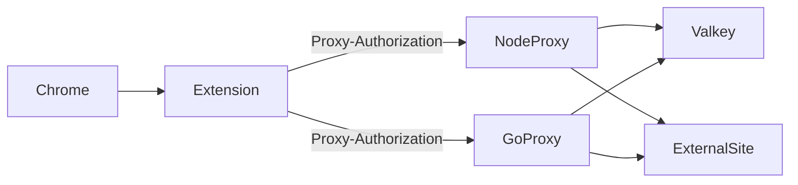

# Forward Proxy with Valkey Domain-Key Auth

Dual HTTP forward proxy implementation (**Node.js** and **Go**) with Valkey-backed **Proxy-Authorization** credentials, plus a **Chrome extension** that injects fixed username/password on every request.

## Overview

Each allowed domain is a Valkey key whose **value is the password**:

| Key | Value |
|-----|-------|
| `sessions:{user_session_id}:{domain}` | password string |

Example: `sessions:alice:google.com` → `s3cret` allows `alice:s3cret` to reach `google.com` and subdomains (`www.google.com` matches key suffix `google.com`).

The same **user session ID + password** works on every proxy server. Add domains by creating new Valkey keys — browser credentials stay fixed.

Every proxied request is gated by:

1. **Client IP allowlist** (`allowedClientIps`)
2. **Public domains** (`publicDomains`) — optional bypass after IP check
3. **Proxy auth** (`requireProxyAuth: true`) — `Proxy-Authorization: Basic` validated against domain keys
4. **Open relay** (`requireProxyAuth: false`) — forward any domain after IP check only (use with caution)

The proxy **never** returns `407`. Missing or invalid credentials yield **403**.



## Quick Start

```bash
docker compose up --build
./benchmarks/seed-sessions.sh
```

| Service | Ports | Role |
|---------|-------|------|
| Valkey | 6379 | Session store |
| node-proxy | 8080, 3001 | Node forward proxy + admin API |
| go-proxy | 8081, 9001 | Go forward proxy + admin API |

## Create domain keys

Proxies are **read-only**. Create keys directly in Valkey:

```bash
./benchmarks/seed-sessions.sh
```

Or manually:

```bash
valkey-cli SET 'sessions:alice:google.com' 's3cret' EX 3600
valkey-cli SET 'sessions:alice:example.com' 's3cret' EX 3600
```

Single key:

```bash
./benchmarks/seed-one.sh alice google.com s3cret config/go-proxy.json
```

Admin API (read-only): `GET /health`, `GET /sessions/{userSessionId}` returns `{ userSessionId, domains: [...] }` (passwords never returned).

## Chrome Extension Setup

1. Open `chrome://extensions` → **Load unpacked** → [`chrome-extension/`](chrome-extension/)
2. **Options** → proxy host/port/scheme (Go=8081, Node=8080)
3. **Popup** → enter **User session ID** + **Password** → Save
4. Browse allowed domains (keys must exist in Valkey)

The extension injects `Proxy-Authorization: Basic base64(user:password)` via declarativeNetRequest on CONNECT and HTTP.

## Manual curl Tests

Allowed:

```bash
curl -v -x http://127.0.0.1:8081 -U 'alice:s3cret' https://google.com -o /dev/null
curl -x http://127.0.0.1:8080 -U 'alice:s3cret' http://example.com/ -I
```

Denied (no key for domain):

```bash
curl -v -x http://127.0.0.1:8081 -U 'alice:s3cret' https://facebook.com -o /dev/null
# 403 domain_not_allowed
```

Wrong password:

```bash
curl -v -x http://127.0.0.1:8081 -U 'alice:wrong' https://google.com -o /dev/null
# 403 invalid_credentials
```

Open relay:

```bash
# requireProxyAuth: false in config
curl -v -x http://127.0.0.1:8081 https://google.com -o /dev/null
```

## Domain matching

For request host `www.google.com`, the proxy checks Valkey keys in order:

1. `sessions:{user}:www.google.com`
2. `sessions:{user}:google.com`
3. `sessions:{user}:com`

First existing key whose value matches the password wins.

## Configuration

**Example** (`config/go-proxy.json`):

```json
{
  "valkeyUrl": "redis://valkey:6379",
  "valkeySessionsPrefix": "sessions",
  "requireProxyAuth": true,
  "publicDomains": [],
  "proxyPort": 8081,
  "adminPort": 9001
}
```

| Field | Description |
|-------|-------------|
| `valkeySessionsPrefix` | Key prefix (default `sessions`) |
| `requireProxyAuth` | When `true`, require `Proxy-Authorization` and domain key match. When `false`, open relay after IP check. |
| `publicDomains` | Hosts that skip auth after IP check (`authMode: "public"`) |

**Local run:**

```bash
node node-proxy/src/index.js --config config/node-proxy.json
go run ./go-proxy/cmd/proxy -config config/go-proxy.json
```

**RHEL / systemd:** [`go-proxy/deploy/README.md`](go-proxy/deploy/README.md)

## Error codes

| Code | Meaning |
|------|---------|
| `403` | `missing_credentials`, `invalid_credentials`, `domain_not_allowed`, or IP blocked |
| `502` | Upstream unreachable or Valkey error |

## Benchmarks

```bash
chmod +x benchmarks/*.sh
./benchmarks/seed-sessions.sh
./benchmarks/run.sh
```

See [`benchmarks/results.md`](benchmarks/results.md).
